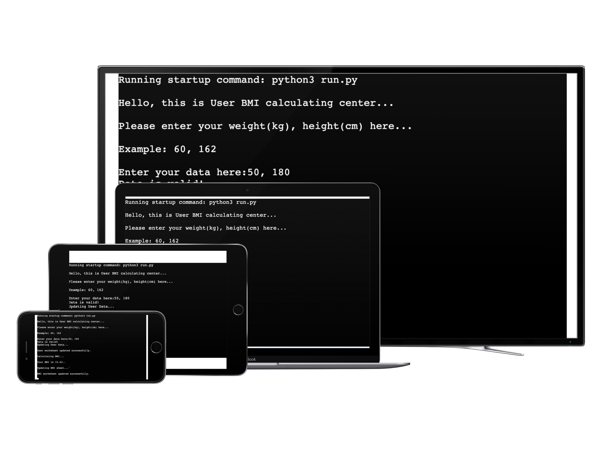

***BMI Calculator***

Hello everyone, 

This is the Code Institute student template for deploying my third portfolio project, the Python command-line project. 

***The Purpose***
Gym A is going to make a workout plan fit for day-to-day people who don't have enough fitness experiences or knowledge. In order to have a analysis on how people's general status is, they need this app for user to input their height and weight so that they can gather this information and calculate the BMI of the user. They can then get a more clear picture of what are the majority status. The user input information (weight and height)and BMI number will then be collected in their google sheet.

For the user, they can see their BMI number at terminal after input their info.

***How to use***
On the program, there will be welcome message and remind message:

User input weight and height in number, the program will calculate the bmi, and then return the message to the screen with BMI results.

And on the Gym A google sheet, there will be user info and bmi sheets included, which updated after user input the info, and bmi gets calculated:

***Other Info***
This program is written in Python, with the help of Love Sandwiches, I use the similar idea to create a simple logic, and to have it runnable on terminal.

In the future, I'd like to complete more basic info such as, BMR calculation and choose workout plan for user based on the analyzed information.

***Validate Test***
This program is tested on PEP8, and passed with no problem:

***Deployment***
This project was successfully deployed on Heroku:
https://bmi0408.herokuapp.com/

***Credits***
Love-Sandwiches walk through classes by Code Institute

